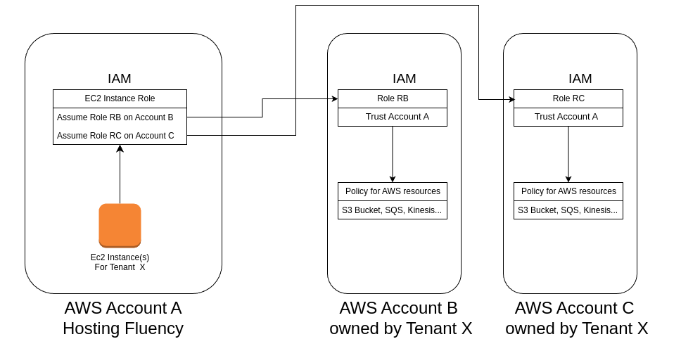

== AWS Authentication

* Fluency/Ingext support three methods for AWS authentication:
** IAM Role:  Assume a role in customer's AWS account
** IAM User:  Use an IAM user's access key and secret
** Access Key: Create a new IAM user and use its access key and secret

* The IAM Role method is recommended for production use.
** The AssumeRole permission for the role is only granted to the Fluency/Ingext EC2 instance(s) serving one specific customer via the EC2 Instance Profile.

* Each Role/AWS User can only holds up to 10 IAM policies. (Can be extended to 20 with a support ticket)
** Each time when we associate one AWS integration with one role/user, one IAM policy will be created and attached to the role/user.
** Create a new role/user if you have more than 10 AWS integrations.

* In Fluency/Ingext, setup roles in "AWS Roles" page.

